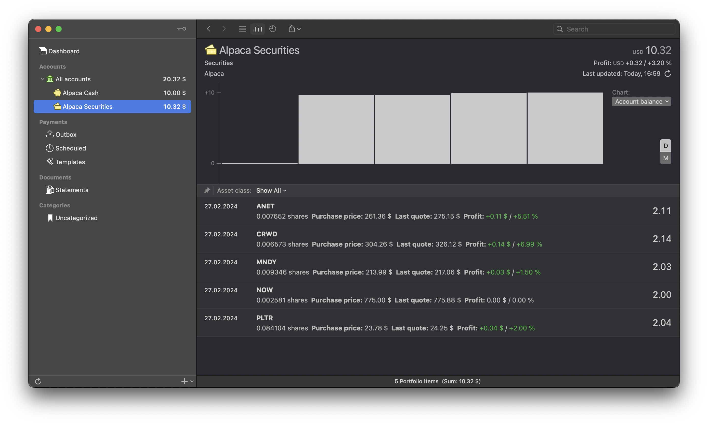

# MoneyMoney Alpaca

Cash balance and securities portfolio from [Alpaca](https://alpaca.markets/).

## Installation

1. Download [Alpaca.lua](https://github.com/dnicolson/MoneyMoney-Alpaca/raw/main/alpaca.lua) extension
2. In MoneyMoney select Help > Show Database in Finder…
3. Copy Alpaca.lua to the Extensions folder

## Accounts

1. Generate API keys from the Alpaca [Dashboard](https://app.alpaca.markets/brokerage/dashboard/overview)
2. Choose + > Add account in MoneyMoney
3. Choose Other > Alpaca
4. Enter the key as the username
5. Enter the secret as the password
